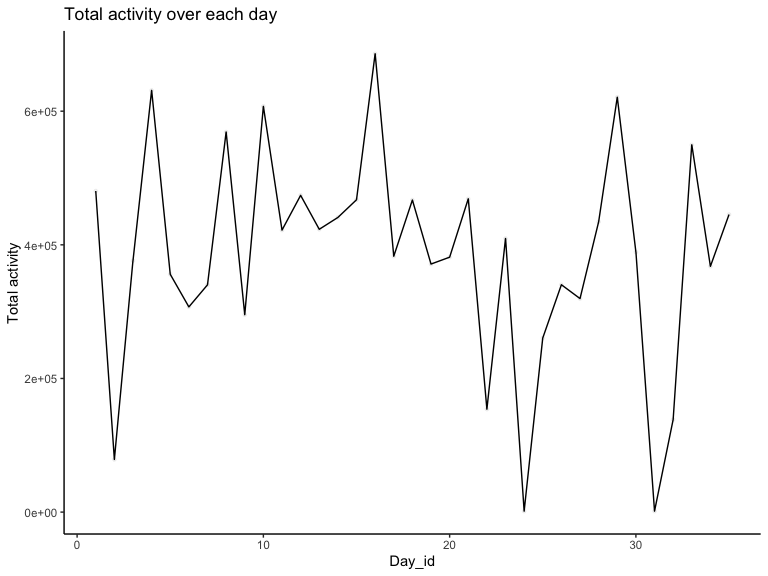

p8105_hw3_fm2751
================
2022-10-15

## Problem 0

Public GitHub repo, local R Project, subdirectory for data, and .Rmd
file created and rendered to github_document.

## Problem 1

### Read in the data

``` r
data("instacart")

instacart = 
  instacart %>% 
  as_tibble(instacart)
```

### Answer questions about the data

This dataset contains 1384617 rows and 15 columns, with each row
resprenting a single product from an instacart order. Variables include
identifiers for user, order, and product; the order in which each
product was added to the cart. There are several order-level variables,
describing the day and time of the order, and number of days since prior
order. Then there are several item-specific variables, describing the
product name (e.g. Yogurt, Avocado), department (e.g. dairy and eggs,
produce), and aisle (e.g. yogurt, fresh fruits), and whether the item
has been ordered by this user in the past. In total, there are 39123
products found in 131209 orders from 131209 distinct users.

Below is a table summarizing the number of items ordered from aisle. In
total, there are 134 aisles, with fresh vegetables and fresh fruits
holding the most items ordered by far.

``` r
  instacart %>% 
    count(aisle) %>% 
  arrange(desc(n))
```

    ## # A tibble: 134 × 2
    ##    aisle                              n
    ##    <chr>                          <int>
    ##  1 fresh vegetables              150609
    ##  2 fresh fruits                  150473
    ##  3 packaged vegetables fruits     78493
    ##  4 yogurt                         55240
    ##  5 packaged cheese                41699
    ##  6 water seltzer sparkling water  36617
    ##  7 milk                           32644
    ##  8 chips pretzels                 31269
    ##  9 soy lactosefree                26240
    ## 10 bread                          23635
    ## # … with 124 more rows

Next is a plot that shows the number of items ordered in each aisle.
Here, aisles are ordered by ascending number of items.

``` r
instacart %>% 
  count(aisle) %>% 
  filter(n > 10000) %>% 
  mutate(aisle = fct_reorder(aisle, n)) %>% 
  ggplot(aes(x = aisle, y = n)) + 
  geom_point() + 
  labs(title = "Number of items ordered in each aisle") +
  theme(axis.text.x = element_text(angle = 60, hjust = 1))
```


Our next table shows the three most popular items in aisles
`baking ingredients`, `dog food care`, and `packaged vegetables fruits`,
and includes the number of times each item is ordered in your table. \*
In `packaged vegetables fruits`, the three most popular items are
Organic Baby Spinach (9784), Organic Raspberries (5546), and Organic
Blueberries (4966); \* In `baking ingredients`, the three most popular
items are Light Brown Sugar (499), Pure Baking Soda (387), and Cane
Sugar (336); \* In `dog food care`, the three most popular items are
Snack Sticks Chicken & Rice Recipe Dog Treats (30), Organix Chicken &
Brown Rice Recipe (28), and Small Dog Biscuits (26).

``` r
instacart %>% 
  filter(aisle %in% c("baking ingredients", "dog food care", "packaged vegetables fruits")) %>%
  group_by(aisle) %>% 
  count(product_name) %>% 
  mutate(rank = min_rank(desc(n))) %>% 
  filter(rank < 4) %>% 
  arrange(desc(n)) %>%
  knitr::kable()
```

| aisle                      | product_name                                  |    n | rank |
|:---------------------------|:----------------------------------------------|-----:|-----:|
| packaged vegetables fruits | Organic Baby Spinach                          | 9784 |    1 |
| packaged vegetables fruits | Organic Raspberries                           | 5546 |    2 |
| packaged vegetables fruits | Organic Blueberries                           | 4966 |    3 |
| baking ingredients         | Light Brown Sugar                             |  499 |    1 |
| baking ingredients         | Pure Baking Soda                              |  387 |    2 |
| baking ingredients         | Cane Sugar                                    |  336 |    3 |
| dog food care              | Snack Sticks Chicken & Rice Recipe Dog Treats |   30 |    1 |
| dog food care              | Organix Chicken & Brown Rice Recipe           |   28 |    2 |
| dog food care              | Small Dog Biscuits                            |   26 |    3 |

Finally is a table showing the mean hour of the day at which Pink Lady
Apples and Coffee Ice Cream are ordered on each day of the week. This
table has been formatted in an untidy manner for human readers. Pink
Lady Apples are generally purchased slightly earlier in the day than
Coffee Ice Cream, with the exception of day 5.

``` r
instacart %>%
  filter(product_name %in% c("Pink Lady Apples", "Coffee Ice Cream")) %>%
  group_by(product_name, order_dow) %>%
  summarize(mean_hour = mean(order_hour_of_day)) %>%
  spread(key = order_dow, value = mean_hour) %>%
  knitr::kable(digits = 2)
```

    ## `summarise()` has grouped output by 'product_name'. You can override using the
    ## `.groups` argument.

| product_name     |     0 |     1 |     2 |     3 |     4 |     5 |     6 |
|:-----------------|------:|------:|------:|------:|------:|------:|------:|
| Coffee Ice Cream | 13.77 | 14.32 | 15.38 | 15.32 | 15.22 | 12.26 | 13.83 |
| Pink Lady Apples | 13.44 | 11.36 | 11.70 | 14.25 | 11.55 | 12.78 | 11.94 |

## Problem 2

### Load and tidy the data

``` r
accel = 
  read_csv("./data/accel_data.csv", col_types = cols()) %>% 
  janitor::clean_names() %>% 
  pivot_longer(
    activity_1:activity_1440,
    names_prefix = "activity_",
    names_to = "time_in_mins",
    values_to = "activity_counts") %>% 
  mutate(
    time_in_mins = as.numeric(time_in_mins),
    week = as.factor(week),
    day = factor(day, levels = c("Sunday", "Monday", "Tuesday", "Wednesday", "Thursday", "Friday", "Saturday")),
    weekday_vs_weekend  = ifelse(day %in% c("Sunday", "Saturday"), print("weekend"), print("weekday"))) %>%
  arrange(day)
```

    ## [1] "weekend"
    ## [1] "weekday"

#### Description of the resulting dataset

The resulting dataset `accel` contains 50400 observations and 6
variables, they are: week, day_id, day, time_in_mins, activity_counts,
weekday_vs_weekend. It’s worth pointing out that activity time is
recorded in minutes, and we added a new variable `weekday_vs_weekend` to
the original dataset to indicate whether the day is a weekday or a
weekend, which can be very helpful in the following analyses.

### Generate a table of total activity/day

``` r
tot_act <-
  accel %>% 
  group_by(day_id) %>% 
  summarise(total_activity = sum(activity_counts))
tot_act %>% knitr::kable()
```

| day_id | total_activity |
|-------:|---------------:|
|      1 |      480542.62 |
|      2 |       78828.07 |
|      3 |      376254.00 |
|      4 |      631105.00 |
|      5 |      355923.64 |
|      6 |      307094.24 |
|      7 |      340115.01 |
|      8 |      568839.00 |
|      9 |      295431.00 |
|     10 |      607175.00 |
|     11 |      422018.00 |
|     12 |      474048.00 |
|     13 |      423245.00 |
|     14 |      440962.00 |
|     15 |      467420.00 |
|     16 |      685910.00 |
|     17 |      382928.00 |
|     18 |      467052.00 |
|     19 |      371230.00 |
|     20 |      381507.00 |
|     21 |      468869.00 |
|     22 |      154049.00 |
|     23 |      409450.00 |
|     24 |        1440.00 |
|     25 |      260617.00 |
|     26 |      340291.00 |
|     27 |      319568.00 |
|     28 |      434460.00 |
|     29 |      620860.00 |
|     30 |      389080.00 |
|     31 |        1440.00 |
|     32 |      138421.00 |
|     33 |      549658.00 |
|     34 |      367824.00 |
|     35 |      445366.00 |

### Generate a plot of total activity/day to see if any trend present

``` r
tot_act %>% 
  ggplot(aes(x = day_id, y = total_activity)) +
  geom_point(size = 1, alpha = .05) +
  geom_line() +
  labs (
    title = "Total activity over each day",
    x = "Day_id",
    y = "Total activity"
  ) +
  theme_classic()
```



#### Description of the output

According to the above table and plot generated from the `accel`
dataset, when we focus on the total activity for each day (i.e.,
`total_activity` vs. `day_id`), there is no any apparent trends
observed. We might need to focus on different groupings to observe an
apparent trend.

### Generate a plot of 24-hour activity time courses for each day, colored by day of the week

``` r
accel %>% 
  mutate(time_in_hs = time_in_mins/60) %>% 
  ggplot(aes(x = time_in_hs, y = activity_counts, fill = day, color = day)) +
  geom_point(alpha = .05) +
  geom_smooth(aes(group = day, color = day)) +
  scale_x_continuous(breaks = seq(0, 24, by = 1)) +
  labs(
    title = "24-hour activity time courses for each day",
    x = "time in a day (hour)",
    y = "activity counts"
  ) +
  theme_minimal()
```

    ## `geom_smooth()` using method = 'gam' and formula 'y ~ s(x, bs = "cs")'


#### Description of the output

Based on this graph, when we focus on activity counts over time (in
hours) for each day, we could observe 4 peaks of activity counts within
a day at time windows: 6:00-8:00, 10:00-12:00, 16:00-18:00, 19:00-21:30.
Activity count is very low between 1:00 and 5:00, and then gradually
increases and fluctuates within the day until 23:00, and gradually
reduced to a relatively low level. By coloring according to the day of
the week, we could see that the trends for each day of the week (from
Monday to Sunday) are actually pretty similar to each other, except for
that we can observe 2 apparent peaks of activity counts on Sunday at
9:00-13:00 and on Friday at 19:00-23:00.

## Problem 3

### Load the data and summary

``` r
data("ny_noaa")

ny_noaa %>% 
  mutate(
     tmax = as.numeric(tmax),
    tmin = as.numeric(tmin)
  ) %>% 
  summary()
```

    ##       id                 date                 prcp               snow       
    ##  Length:2595176     Min.   :1981-01-01   Min.   :    0.00   Min.   :  -13   
    ##  Class :character   1st Qu.:1988-11-29   1st Qu.:    0.00   1st Qu.:    0   
    ##  Mode  :character   Median :1997-01-21   Median :    0.00   Median :    0   
    ##                     Mean   :1997-01-01   Mean   :   29.82   Mean   :    5   
    ##                     3rd Qu.:2005-09-01   3rd Qu.:   23.00   3rd Qu.:    0   
    ##                     Max.   :2010-12-31   Max.   :22860.00   Max.   :10160   
    ##                                          NA's   :145838     NA's   :381221  
    ##       snwd             tmax              tmin        
    ##  Min.   :   0.0   Min.   :-389.0    Min.   :-594.0   
    ##  1st Qu.:   0.0   1st Qu.:  50.0    1st Qu.: -39.0   
    ##  Median :   0.0   Median : 150.0    Median :  33.0   
    ##  Mean   :  37.3   Mean   : 139.8    Mean   :  30.3   
    ##  3rd Qu.:   0.0   3rd Qu.: 233.0    3rd Qu.: 111.0   
    ##  Max.   :9195.0   Max.   : 600.0    Max.   : 600.0   
    ##  NA's   :591786   NA's   :1134358   NA's   :1134420

### Check missing values

``` r
ny_noaa %>% 
  summarise(    
    na_in_prcp = sum(is.na(prcp)/nrow(ny_noaa)),
    na_in_snow = sum(is.na(snow)/nrow(ny_noaa)),
    na_in_snwd = sum(is.na(snwd)/nrow(ny_noaa)),
    na_in_tmax = sum(is.na(tmax)/nrow(ny_noaa)),
    na_in_tmin = sum(is.na(tmin)/nrow(ny_noaa))
    ) %>% 
  knitr::kable(digits = 2)
```

| na_in_prcp | na_in_snow | na_in_snwd | na_in_tmax | na_in_tmin |
|-----------:|-----------:|-----------:|-----------:|-----------:|
|       0.06 |       0.15 |       0.23 |       0.44 |       0.44 |

#### Description of the current dataset

The dataset `ny_noaa` contains 2595176 observations/rows and 7
variables/columns, they are: id, date, prcp, snow, snwd, tmax, tmin.
Data was collect from 1981-01-01 to 2010-12-31. Here, the variable `id`
is the weather station ID; variable `prcp` represents for precipitation
and is recorded in tenths of mm; variables `snow` (snowfall) and `snwd`
(snow depth) are both recorded in mm; variables `tmax` (maximum
temperature) and `tmin` (minimum temperature) are both recorded in
tenths of degrees C. The median of tmax is 15C; the median of tmin is
3.3C; the mean of prcp is 2.98mm. It’s worth pointing out that there is
a huge amount of missing values (NAs) in our current dataset for
variables `prcp` (\~6% missing), `snow` (\~15% missing), `snwd` (\~23%
missing), `tmax` (\~44% missing), and `tmin` (\~44% missing). We could
already see the effect of missing data from the summary output, in which
the Minimum, 1st Quantile, Median, and 3rd Quantile are all missing for
`snwd`, as well as the missing summary report for `prcp` and `snow`.
These missing data could also lead to bias in the later analyses.

### Data cleaning and units conversion

NOTE: I would convert tenths of mm to mm and tenths of degrees C to
degrees C, for convenience and easier understanding.

``` r
noaa_clean <-
  ny_noaa %>% 
  janitor::clean_names() %>%
  separate(date, c("year", "month", "day"), sep = "-") %>% 
  mutate(
    year = as.numeric(year),
    month = as.numeric(month),
    day = as.numeric(day),
    prcp = as.numeric(prcp)/10,
    tmax = as.numeric(tmax)/10,
    tmin = as.numeric(tmin)/10,
    snow = as.numeric(snow),
    snwd = as.numeric(snwd)
    )
```

### Most commonly observed values for snowfall

``` r
noaa_clean %>% 
  group_by(snow) %>% 
  summarise(n = n()) %>% 
  arrange(desc(n))
```

    ## # A tibble: 282 × 2
    ##     snow       n
    ##    <dbl>   <int>
    ##  1     0 2008508
    ##  2    NA  381221
    ##  3    25   31022
    ##  4    13   23095
    ##  5    51   18274
    ##  6    76   10173
    ##  7     8    9962
    ##  8     5    9748
    ##  9    38    9197
    ## 10     3    8790
    ## # … with 272 more rows

#### Description of the output

According to the output, we could see that the most common observed
value for snowfall is 0. This is because in NY state, snowfalls only
observed during winter, so its frequency should be low regarding to a
dataset collecting weather information for \~30 years. So, it is very
reasonable that 0 is the most common observed value for snowfall.

### two-panel plot for January and for July

``` r
noaa_clean %>% 
  filter(month %in% c(1,7)) %>% 
  mutate(month = recode(month, "1" = "January", "7" = "July")) %>% 
  group_by(id, year, month) %>% 
  summarise(ave_tmax = mean(tmax, na.rm = TRUE)) %>% 
  ggplot(aes(x = year, y = ave_tmax, fill = month, color = month)) +
  geom_point() +
  geom_smooth() +
  facet_grid(~month) +
  labs(
    title = "Average max temperature in January and in July in NY state",
    x = "Year",
    y = "Average max temperature (C)",
    caption = "Data from the p8105.datasets package"
  ) +
  scale_x_continuous(breaks = seq(1980, 2010, by = 5)) +
  viridis::scale_fill_viridis(discrete = TRUE)
```

    ## `summarise()` has grouped output by 'id', 'year'. You can override using the
    ## `.groups` argument.
    ## `geom_smooth()` using method = 'gam' and formula 'y ~ s(x, bs = "cs")'


#### Description of the output

Based on the plot, we could clearly see that the average max temperature
in July is always higher than that in January in NY state. Even the
lowest outlier of average max temperature in July is higher than the
highest average max temperature in January. There are some outliers. For
example: the lowest average max temperature were below -10C in Jan 1982
and Jan 2005, the highest average max temperature was reaching 10C in
Jan 2004, the lowest average max temperature were below 15C in Jul 1988.

### two-panel plots

-   1)  tmax vs tmin for the full dataset

-   2)  distribution of snowfall by year

``` r
tmax_vs_tmin <-
  noaa_clean %>% 
  ggplot(aes(x = tmin, y = tmax)) +
  geom_hex() +
  scale_fill_gradient(low="lightblue1",high="darkblue") +
  geom_smooth() +
  labs(
    title = "Maximum temperature vs. minimum temperature in NY state",
    x = "Minimum temperature (c)",
    y = "Maximum temperature (c)",
    caption = "Data from the p8105.datasets package"
  ) +
    scale_x_continuous(breaks = seq(-60, 65, by = 10)) +
    scale_y_continuous(breaks = seq(-40, 65, by = 10)) +
  theme(plot.title = element_text(size=8))


snowfall <-
  noaa_clean %>% 
  filter(snow > 0, snow < 100) %>% 
  mutate(year = as.character(year)) %>% 
  ggplot(aes(x = year, y = snow)) +
  geom_violin(aes(fill = year, color = year), alpha = .5) +
  labs(
    title = "Distribution of snowfall by year",
    x = "Year",
    y = "Snowfall",
    caption = "Data from the p8105.datasets package"
  ) +
  theme(
    legend.position = "none",
    axis.text.x = element_text(angle = 90, hjust = 1),
    plot.title = element_text(size=8)
    )

tmax_vs_tmin + snowfall
```

    ## `geom_smooth()` using method = 'gam' and formula 'y ~ s(x, bs = "cs")'


#### Comments on the output

Based on the hexagonal two-dimensional heatmap (left panel), the darker
the color, the higher the count. We could straightforwardly see that the
most common observed maximum temperature is \~25C and the most common
observed maximum temperature is \~15C, in NY state between 1981 and
2010. This results do not seem reasonable to me because remember we have
44% missing data in both `tmin` and `tmax`. Based on the violin plots
for each year (right panel), we could see that the statistic for
snowfall did not change much, shapes of the plots are very similar to
each other, indicating the trend of snowfall did not changed much
between 1981 and 2010, in NY state.
